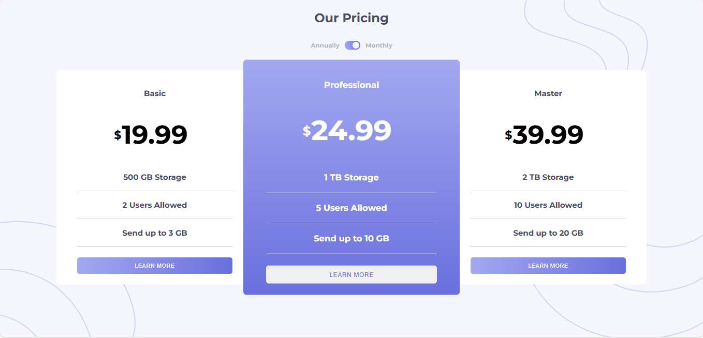

# Frontend Mentor - Pricing component with toggle

This is a solution to the [Pricing component with toggle
](https://www.frontendmentor.io/challenges/pricing-component-with-toggle-8vPwRMIC). Frontend Mentor challenges help you improve your coding skills by building realistic projects.

## Table of contents

- [Overview](#overview)
  - [The challenge](#the-challenge)
  - [Screenshot](#screenshot)
  - [Links](#links)
  - [Installation](#Installation)
- [My process](#my-process)
  - [Features](#Features)
  - [Usage](#Usage)
  - [What I learned](#what-i-learned)
  - [Continued development](#continued-development)
- [Author](#author)
- [Acknowledgments](#Acknowledgments)

## Overview

### The challenge

This challenge will get you thinking about building an accessible custom toggle control and also test your layout skills.

Your users should be able to:

- Control the toggle with both their mouse/trackpad and their keyboard.
- View the optimal layout for the interface depending on their device's screen size
- See hover and focus states for all interactive elements on the page
- **Bonus**: Complete the challenge with just HTML and CSS

### Screenshot



### Links

- Solution URL: [here](https://github.com/olahasan/HTML_CSS_AND_J.S_Frontend-Mentor_JUNIOR-Pricing-component-with-toggle)

- Live Site URL: [here](https://olahasan.github.io/HTML_CSS_AND_J.S_Frontend-Mentor_JUNIOR-Pricing-component-with-toggle/)

## Installation

To get a local copy up and running, follow these simple steps:

1. **Clone the repository**:

   ```sh
   git clone https://github.com/your-username/your-repo-name.git
   ```

2. **Navigate to the project directory**:

   ```sh
   cd your-repo-name
   ```

3. **Open the project in your preferred code editor**.

## My process

## Features

- Responsive design
- Toggle switch to switch between monthly and annual pricing
- Interactive elements with keyboard accessibility

## Usage

- Click on the toggle switch to switch between monthly and annual pricing or use tap key on keyboard.
- Use the left and right arrow keys to control the toggle switch for better accessibility.

### What I Learned

- **HTML & CSS:** Improved my understanding of semantic HTML and responsive design using CSS Grid and Flexbox.
- **JavaScript:** Learned how to use event delegation and manage state changes efficiently.
- **Accessibility:** Gained insights into making web components more accessible by adding keyboard controls and focus management.

### Continued Development

- **Enhanced Accessibility:** Plan to add more accessibility features, such as ARIA roles and labels.
- **Animations:** Implement smooth animations for the toggle switch and other interactive elements.
- **Backend Integration:** Explore integrating with a backend service to dynamically fetch pricing data.

### Author

Frontend Mentor - @olahasan<br>
GitHub - @olahasan

### Acknowledgments

I would like to thank the **Frontend Mentor** for providing this challenge and to the community for their support and feedback
